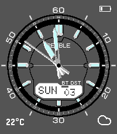
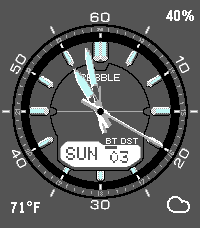

# WVA-M640D

A Pebble watchface written in C. Inspired by the iconic Casio WVA-M640D. Includes connectivity status, DST ststus, live weather, battery status, and battery saving flick-to-reveal seconds hand.

<p align="center">
  
  &nbsp;&nbsp;&nbsp;
  
</p>

## Features

- **Analog hands** — Hour, minute, and seconds hand
- **Flick to show seconds** — Flick your wrist to reveal the seconds hand for 5 seconds, or keep it always on/off.
- **Live weather** — Current temperature and conditions via OpenWeatherMap, using your phone's GPS
- **Battery indicator** — Choose between an icon or a percentage readout; shows charging status when plugged in
- **Bluetooth alert** — On-screen indicator with optional vibration when your phone disconnects
- **Day & date** — Day of the week and date displayed in the center dial
- **DST indicator** — Knows when daylight saving time is active

## Settings

All settings are configurable through the Pebble companion app:

| Setting | Options |
|---|---|
| Temperature unit | Celsius / Fahrenheit |
| Seconds hand | Always on, off, or on flick |
| Battery display | Icon or percentage |
| Bluetooth vibration | On / Off |
| OpenWeatherMap API key | Your own key for weather data |

## Building & running

```sh
pebble build                          # build for all targetPlatforms
pebble install --emulator emery       # install on the emery emulator
pebble install --phone <ip>           # install to a paired phone
```

## Documentation

Full SDK docs, tutorials, and API reference: <https://developer.repebble.com>
